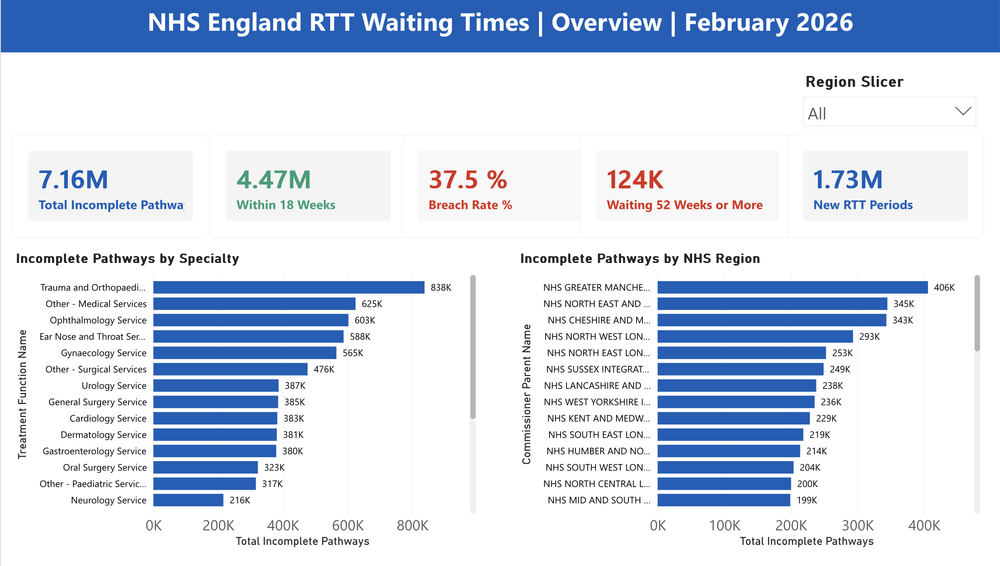
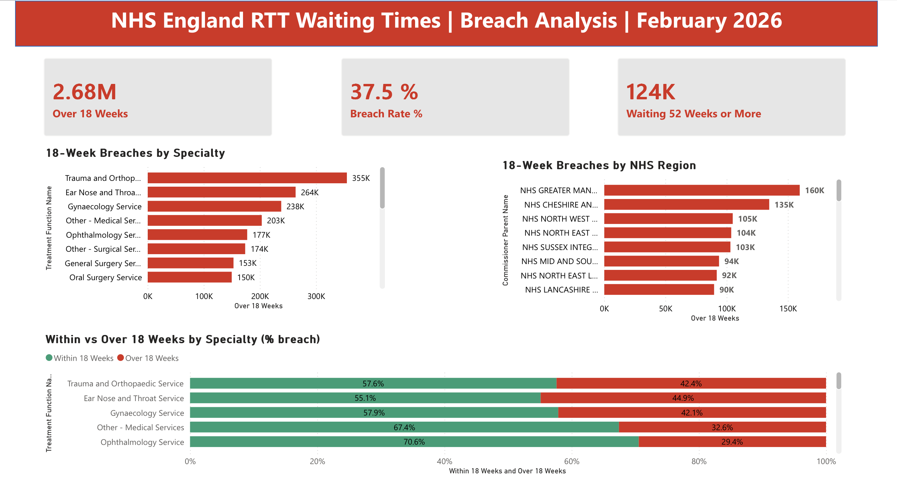
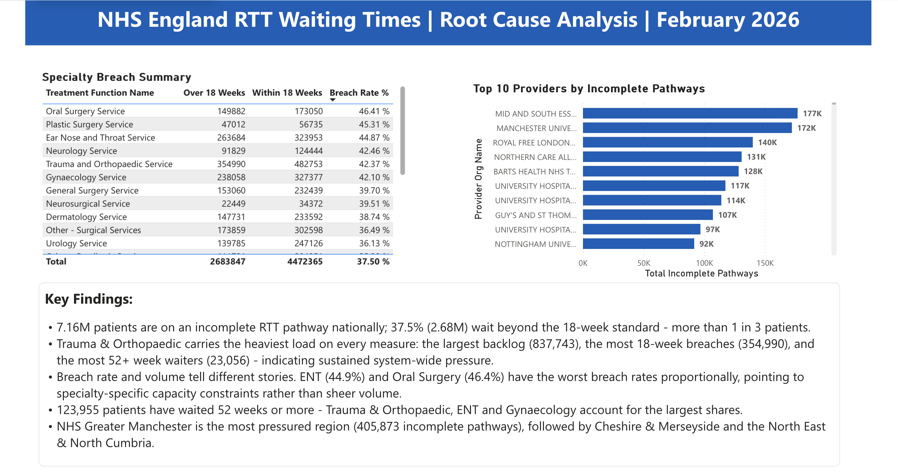

# NHS Referral to Treatment (RTT) Waiting Times Analysis

**SQL + Power BI Data Analysis Project | February 2026 | National (England-wide)**

## Project Overview

This project analyses the complete NHS England Referral to Treatment (RTT) waiting times dataset for February 2026, covering all integrated care board regions and provider trusts across England. Using **MySQL** for the analysis and **Power BI** for an interactive three-page dashboard, I explored waiting list pressures across specialties, providers, and regions — connecting my background in public health and NHS community engagement to practical data analysis skills.

**Data Source:** NHS England Consultant-led RTT Waiting Times — Full CSV data file, February 2026
**Scale:** 181,233 data rows · 43 commissioner regions · 514 provider trusts
**Tools:** MySQL · DBeaver · Power BI · DAX
**Skills:** SQL · DAX · Data Visualisation · Large Dataset Handling · Health Data Analysis · Data Cleaning

> **Note on data quality:** The NHS England raw dataset contains a built-in summary "Total" row (treatment function code C_999) alongside individual specialty rows. All queries explicitly exclude this using a `!= 'Total'` filter on the Treatment Function Name column to ensure accurate, non-duplicated results. Empty week-band cells are treated as zero. Identifying and handling this was a key part of the data cleaning process.

---

## Interactive Power BI Dashboard

A three-page Power BI report built on the full national dataset, designed around real NHS RTT reporting conventions (within/over 18-week banding, breach rate, and root-cause framing).

### Page 1 — Overview
National headline KPIs, waiting list by specialty, and waiting list by NHS region, with a region slicer to filter the whole page.



### Page 2 — Breach Analysis
18-week breaches by specialty and region, plus a 100% stacked bar showing the within-vs-over-18-week split per specialty — surfacing which specialties breach worst *proportionally*, not just by volume.



### Page 3 — Root Cause Analysis
A specialty breach-rate summary table, the top 10 provider trusts by waiting list, and a written key-findings panel translating the data into actionable insight.



### Key DAX Measures
```DAX
Total Incomplete Pathways =
CALCULATE(
    SUM('NHS RTT National Feb 2026'[Total All]),
    'NHS RTT National Feb 2026'[RTT Part Description] = "Incomplete Pathways"
)

Within 18 Weeks = [Total Incomplete Pathways] - [Over 18 Weeks]

Breach Rate % = DIVIDE([Over 18 Weeks], [Total Incomplete Pathways])

New RTT Periods =
CALCULATE(
    SUM('NHS RTT National Feb 2026'[Total All]),
    'NHS RTT National Feb 2026'[RTT Part Description] = "New RTT Periods - All Patients"
)
```
*The Over 18 Weeks and Waiting 52 Weeks or More measures sum the relevant weekly wait-bands (1–18 weeks, and 52+ weeks respectively), filtered to incomplete pathways. Full definitions are in the report file.*

---

## Key Findings

- **7,156,212** patients were on incomplete pathways (still waiting) across NHS England in February 2026
- **37.5% breach rate** against the 18-week standard — more than 1 in 3 patients waiting beyond 18 weeks (2,683,847 patients)
- **124,280** patients had been waiting 52 weeks or more
- **1,728,233** new RTT pathways started in February 2026
- **Trauma and Orthopaedic** had the highest waiting list with 837,743 patients — and the most 18-week breaches (354,990) and the most 52-week-plus waiters (23,056)
- Breach *rate* tells a different story from volume: **ENT (44.9%)** and **Oral Surgery (46.4%)** breach worst proportionally, signalling specialty-specific capacity constraints
- **NHS Greater Manchester** was the most pressured region with 405,873 patients waiting
- **Mid and South Essex NHS Foundation Trust** had the largest provider waiting list with 176,895 patients

---

## Questions Answered

| # | Question |
|---|----------|
| 1 | Which treatment specialties have the most patients currently waiting? |
| 2 | Which NHS providers have the highest total waiting patients? |
| 3 | What is the breakdown of pathway types across the dataset? |
| 4 | Which commissioner regions have the most patients waiting? |
| 5 | How many new RTT periods started in February 2026? |
| 6 | Which specialties have the most patients waiting 52 weeks or more? |
| 7 | How do admitted vs non-admitted completed pathways compare by specialty? |
| 8 | Which provider has the best performance within 18 weeks? |
| 9 | Which commissioner regions have the highest incomplete pathways? |
| 10 | Which specialties have the most patients breaching the 18-week target? |

---

## The Insight

The national backlog is concentrated in high-volume surgical and procedural specialties. Trauma & Orthopaedic, ENT, Gynaecology and Ophthalmology together account for the bulk of both the total waiting list and the 18-week breaches — this is primarily a **volume and capacity problem in elective surgical pathways**, not a single-specialty anomaly.

Crucially, **volume and breach rate are not the same story**. Trauma & Orthopaedic has the most breaching patients in raw numbers, but ENT (44.9%) and Oral Surgery (46.4%) have the highest breach *rates* — meaning a far greater proportion of their waiting patients miss the 18-week standard. This distinction matters for resource allocation: high-volume specialties need throughput capacity, while high-breach-rate specialties may face specific bottlenecks.

Long waits of 52 weeks or more (124,280 patients nationally) are spread across many specialties rather than concentrated in one, led by Trauma & Orthopaedic (23,056), ENT (15,490) and Gynaecology (13,160). This points to system-wide elective capacity pressure rather than an isolated bottleneck, which matters for how capacity and workforce are prioritised nationally.

---

## Repository Structure

​```
nhs-rtt-analysis/
├── nhs_rtt_queries.sql
├── README.md
├── Dashboards/
│   ├── dashboard_overview.png
│   ├── dashboard_breach.png
│   └── dashboard_root_cause.png
└── results/
    ├── query1_specialties_most_waiting.csv
    ├── query2_providers_most_waiting.csv
    ├── query3_pathway_breakdown.csv
    ├── query4_commissioner_regions.csv
    ├── query5_new_rtt_periods.csv
    ├── query6_over_52_weeks.csv
    ├── query7_admitted_vs_nonadmitted.csv
    ├── query8_best_performance.csv
    ├── query9_commissioner_incomplete.csv
    └── query10_18_week_breach.csv
​```

---

## Why This Project

I worked directly with people affected by NHS waiting times during my time as a Community Engagement Practitioner at North London NHS Foundation Trust. I have seen first-hand how delays in treatment affect people's lives. This project combines that real-world context with my public health training and data skills to ask meaningful questions of real, national NHS data.

---

## About Me

**Adaeze (Princess) Umahi**
Data Analyst | MPH — Epidemiology, Biostatistics & Data Science (University of Glasgow) | MBBS
SQL · Python · R · Power BI · Tableau · Microsoft Dynamics 365
Google Data Analytics Certified | Code First Girls & DataCamp — SQL, Python, AI & Machine Learning | Data Analyst with Python (DataCamp) | Machine Learning Fundamentals (DataCamp)

Building a portfolio at the intersection of health data, business intelligence and real-world analytical impact.

[LinkedIn](https://www.linkedin.com) | [GitHub](https://github.com/PrincessUmahi)
