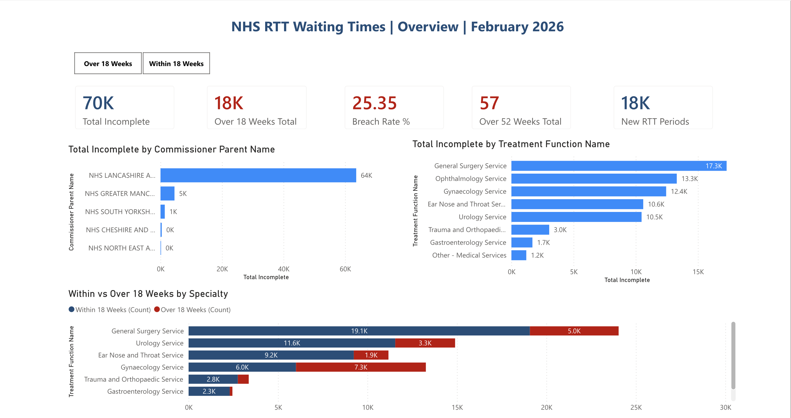
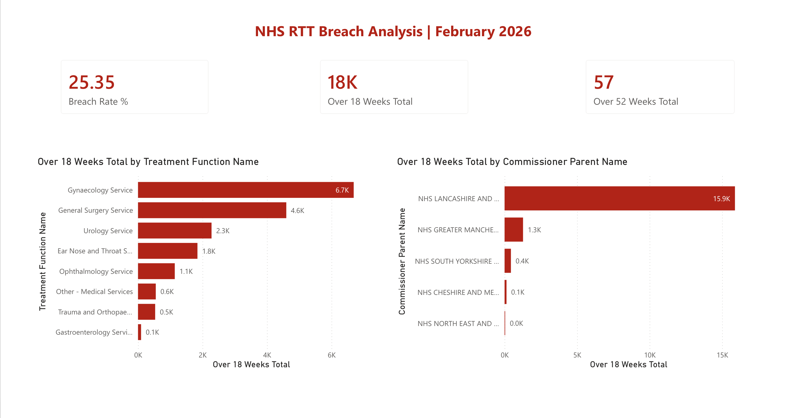
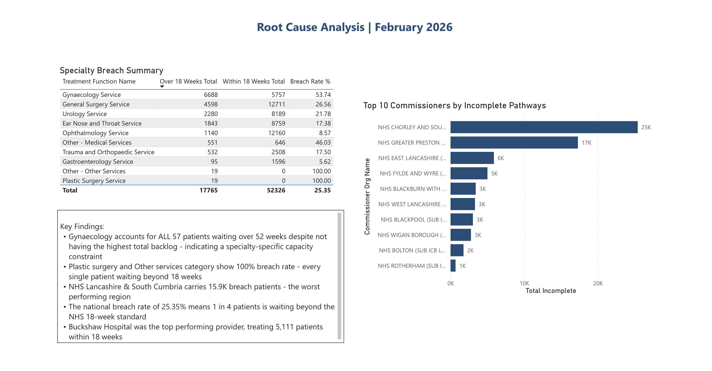

# NHS Referral to Treatment (RTT) Waiting Times Analysis
**SQL Data Analysis Project | February 2026**

## Project Overview
This project analyses publicly available NHS England Referral to Treatment (RTT) waiting times data for February 2026. Using MySQL and SQL querying, I explored waiting list pressures across specialties, providers, and regions — connecting my background in public health and NHS community engagement to practical data analysis skills.

**Data Source:** NHS England RTT Waiting Times Statistics 2025-26  
**Tools:** MySQL · DBeaver · Power BI  
**Skills:** SQL · Database Design · Health Data Analysis · Power BI · Data Visualisation  

> **Note on data quality:** The NHS England raw dataset contains built-in summary "Total" rows alongside individual specialty rows. All queries in this project explicitly exclude these rows using `AND \`Treatment Function Name\` != 'Total'` to ensure accurate, non-duplicated results. Identifying and handling this was a key part of the data cleaning process.

---

## Key Findings
- **70,091** patients were on incomplete pathways (still waiting) in February 2026
- **General Surgery** had the highest waiting list with **17,309 patients**
- **Gynaecology** had the most patients breaching the 18-week NHS target — **6,688 patients**
- **17,537** new patients joined the waiting list in February 2026
- **NHS Lancashire and South Cumbria** was the most pressured region with **63,612 patients** waiting
- **Buckshaw Hospital** had the best performance, treating **5,111 patients** within 18 weeks
- **Gynaecology** had the most patients waiting over 52 weeks — **57 patients**

---

## Questions Answered
| # | Question |
|---|---|
| 1 | Which treatment specialties have the most patients currently waiting? |
| 2 | Which NHS providers have the highest total waiting patients? |
| 3 | What is the breakdown of pathway types across the dataset? |
| 4 | Which commissioner regions have the most patients waiting? |
| 5 | How many new RTT periods started in February 2026? |
| 6 | Which specialty has the most patients waiting over 52 weeks? |
| 7 | How do admitted vs non-admitted completed pathways compare by specialty? |
| 8 | Which provider has the best performance within 18 weeks? |
| 9 | Which commissioner regions have the highest incomplete pathways? |
| 10 | Which specialties have the most patients breaching the 18-week target? |

---

## Repository Structure
nhs-rtt-analysis/
├── nhs_rtt_queries.sql
└── results/
    ├── query1_specialties_most_waiting.csv
    ├── query2_providers_most_waiting.csv
    ├── query3_pathway_breakdown.csv
    ├── query4_commissioner_regions.csv
    ├── query5_new_rtt_periods.csv
    ├── query6_over_52_weeks.csv
    ├── query7_admitted_vs_nonadmitted.csv
    ├── query8_best_performance.csv
    ├── query9_commissioner_incomplete.csv
    └── query10_18_week_breach.csv
├── NHS_RTT_Dashboard_February_2026.pbix
└── nhs-rtt-analysis_Power_BI_Screenshot_.png
├── page1of1_overview.png
├── page2_breach_analysis.png
└── page3_root_cause.png

---

## Power BI Dashboard
## Power BI Dashboard — Updated May 2026

Built an interactive 3-page NHS RTT Waiting Times Dashboard in 
Power BI using this dataset.

### Page 1 — Overview

### Page 2 — Breach Analysis

### Page 3 — Root Cause Analysis

---

## Why This Project
I worked directly with people affected by NHS waiting times during my time as a Community Engagement Practitioner at North London NHS Foundation Trust. I have seen first-hand how delays in treatment affect people's lives. This project combines that real-world context with my public health training and growing data skills to ask meaningful questions of real NHS data.

---

## About Me
**Adaeze (Princess) Umahi**  
Data Analyst | Medical Doctor (MBBS) | MPH — Epidemiology, Biostatistics & Data Science (University of Glasgow)  
SQL · Python · R · Power BI · Tableau · Microsoft Dynamics 365  
Google Data Analytics Certified | Code First Girls & DataCamp — SQL, Python, AI & Machine Learning | Data Analyst with Python (DataCamp) | Machine Learning Fundamentals (DataCamp) | Microsoft Power BI PL-300 (In Progress)  
Building a portfolio at the intersection of health data, business intelligence and real-world analytical impact.  
[LinkedIn](https://www.linkedin.com/in/adaezeumahi/) | [GitHub](https://github.com/PrincessUmahi)
